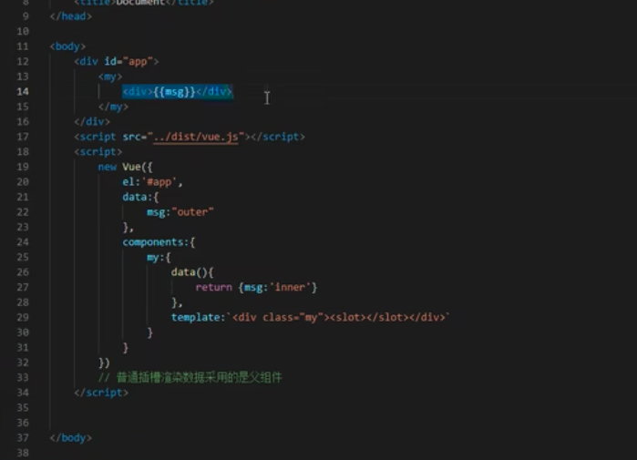
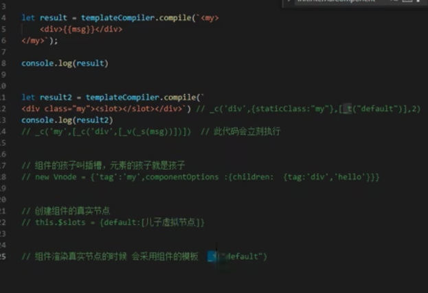
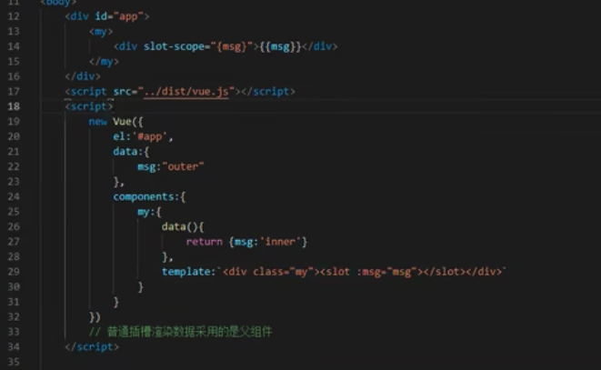
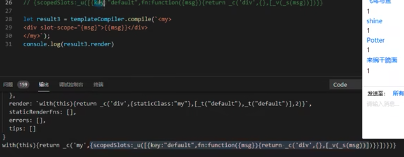
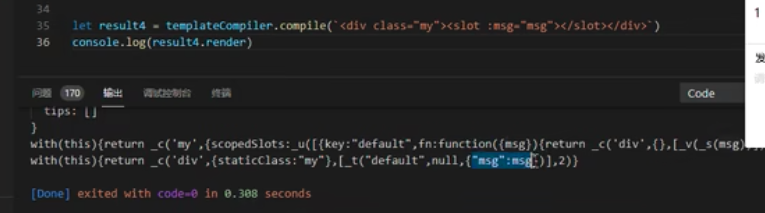
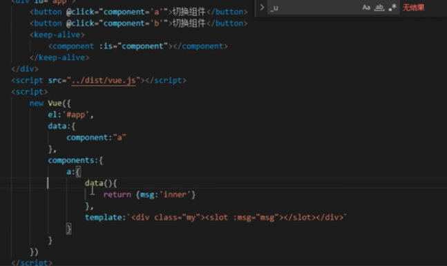
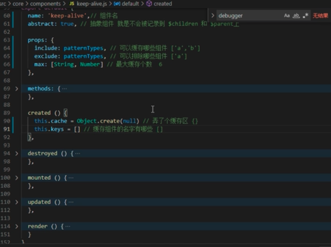
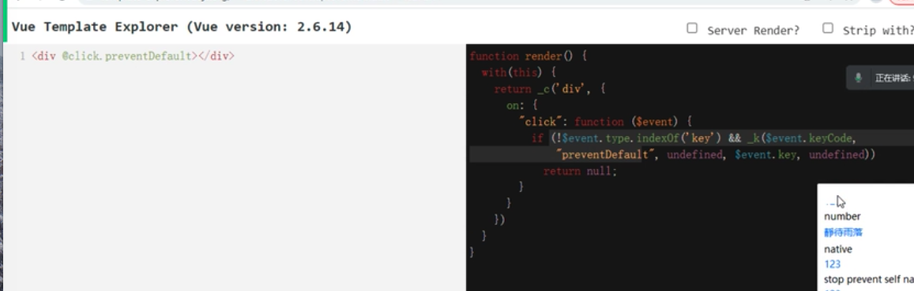

# 优化
1. 使用vue的时候如果data层级过深（考虑优化），如果数据不是响应式的就不要放入data中了，我们属性取值的时候尽量避免多次取值。如果有些对象是放在data中的但是不是响应式的考虑采用Object.freeze()来冻结对象

2. vue2中检测数据的变化并没有采用defineProperty因为修改的索引的情况不多（如果直接使用defineProperty会浪费大量性能）。而是采用重写数组的变异方法来实现。arr[1]="fdfa"是无效的。

3. 依赖收集，被观察者指代数据data，观测者watcher（渲染watcher，计算属性，用户watcher（用户用的监听器）） 在调用this.get()是给被观察者添加watcher

4. beforCreate没有实现下响应式数据，create时已经初始化响应式数据了
initLifecycle(vm)初始化$parent $children
initEvents(vm)初始化$on $off $emit
intiRender(vm) 声明一些变量
callhook(vm,'beforcreate')
initInjections(vm) 初始化inject方法
initState(vm)
initProvide(vm)
callhooke(vm,'created')

5. 请求是异步任务 等同步代码执行以后才会做所以不纠结是放在created还是mounted上

6. $attrs 不包含props 是响应式的

    $listeners


7. v-if v-for 
   
        哪个优先级高一些 v-if优先级更高    vue-template-explore 模版解析工具可以去试一试


        同时用在一个标签上每循环一次就判断一次 v-if 最好不要在一起使用

        v-if 在编译时会变成三元表达式，但是v-show会变成一个指令

        v-for编译成_l循环   core/instance/render-helpers/renderList

8. v-model 
        放在组件上 会被编译成一个对象model:{
            value,
            callback callback是组件编译时赋予
        }


        组件定义的model:{ 不写model就是赋予的默认值
            prop:'aaa',默认value
            event:'input'默认input
        }


        在组件创建虚拟节点时生成此对象

        prop=value

        on[event]=callback 挂载到了$listeners 使用this.$emit


        放在元素上实现双向绑定 对于不同的type 有不同的的编译

        针对文本来说会被编译成 value +input +指令处理

9. .sync修饰符的作用
    
        和v-model 一样 这个API是为了实现状态同步的

10. Vue.use
```js
let plugin=function(Vue,options){//第一种写法
    console.log(Vue,options)
}
let plugin2={//第二种写法
    install(Vue,options){
        console.log(Vue,options)
        
    }
    
}
Vue.use(plugin,{a:1,b:2})//基本上所有的插件都都差不多是一个函数
//use()方法目的就是将vue的构造函数传递给插件中，让所有的插件依赖的Vue是同一个版本

```

11. vue中有name属性的组件可以背递归调用,用来标示组件 vm.$options.name=name
    
        在声明组件的时候

        if(name){
            Sub.options.components[name]=Sub
        }
12. slot插槽，正常的渲染过程是在父组件里的 父组件渲染好传入到插槽
    
    普通插槽渲染数据是采用父组件 作用域在父组件

    

    插槽编译

    

    根实例初始化conponents编译模版遇到组件字符编译时有孩子在创建组件虚拟节点时将children弄到组件势力的$solt[name]上,下一步根实例挂载阶段创建真实dom
    遇到就是组件挂载sub.$mount()编译时读到solt时编译成_t('default') 通过_t函数内部得到this.$solt[name]上的 把组件变成真实dom 组件挂载完成继续后面顺序创建真实节点

    作用域插槽
    我们渲染插槽作用域是在子组件 

    作用域插槽渲染的时候不会作为children，将作用域插槽做成一个属性scopedSlots
    做一个映射 $scopeSlots={[name]:fn:function({msg}{return _c(div,{},[_v(msg)])})}

    然后组件的挂载将数据传入函数中返回虚拟节点

    


    作用域编译
    
    


    区别 普通，具名{name:[vnode]} 作用域{name:fn}

13. keep-live

    
    keep-live组件
    


14. 指令
    自定义指令就是用户定义好对应的钩子，当元素在不同状态会被调用对应的钩子

    所有的钩子会被到cbs对应的方法上，到时候依次调用


15. 修饰符 
        1种实现主要靠的是模版编译 stop prevent
            
        2种是编译时增加标识别 capture，once，passive
